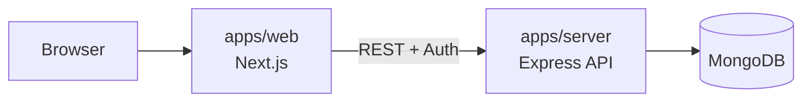

TicketFlow is a full-stack ticketing platform built in a Turborepo monorepo.

This documentation explains how the application works end-to-end:

- frontend architecture and route groups
- backend architecture and API layers
- authentication and authorization behavior
- reservation and booking lifecycle
- deployment setup for Render (API) and Vercel (web)

## Stack Overview

| Layer | Technology |
| --- | --- |
| Monorepo | Turborepo + Bun workspaces |
| Frontend | Next.js App Router (`apps/web`) |
| Backend | Express + Better Auth + Mongoose (`apps/server`) |
| Database | MongoDB Atlas |
| Shared packages | `@repo/ui`, `@repo/types`, `@repo/auth` |

## Application Topology



## Local Development

### Prerequisites

- Bun 1.3+
- Node.js 18+
- MongoDB connection string

### Install and run

```bash
git clone https://github.com/soxamz/ticket-flow.git
cd ticket-flow
bun install
bun dev
```

### Default local URLs

| Service | URL |
| --- | --- |
| Web app | http://localhost:3000 |
| Docs app | http://localhost:3001 |
| API server | http://localhost:4000 |

## Read Next

- [Project Structure](./project-structure)
- [Backend Architecture](./backend-architecture)
- [Frontend Architecture](./frontend-architecture)
- [Routes and Booking Flows](./routes-and-flows)
- [Deployment Guide](./deployment)

## Scripts

```bash
bun dev
bun run build
bun run lint
bun run typecheck
```
