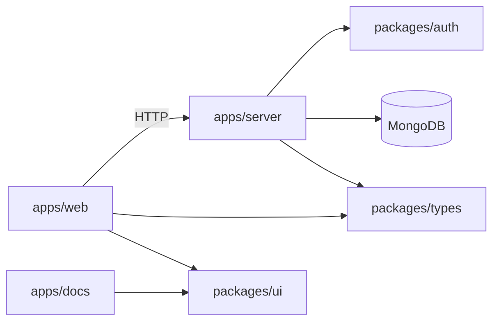

## Monorepo Layout

```
ticket-flow/
├── apps/
│   ├── web/            # Customer + admin web app (Next.js)
│   ├── server/         # Express API + auth + jobs
│   └── docs/           # Documentation site (Fumadocs)
├── packages/
│   ├── ui/                # Shared UI components and styles
│   ├── auth/              # Better Auth initialization
│   ├── types/             # Shared API/domain TypeScript types
│   ├── biome-config/      # Shared Biome config
│   └── typescript-config/ # Shared tsconfig presets
├── turbo.json             # Task graph and caching
├── package.json           # Root scripts/workspace config
└── bun.lock               # Dependency lockfile
```

## Apps

### `apps/web`

Main application users interact with.

- Framework: Next.js App Router
- Primary route groups:
  - `(landing)` marketing pages
  - `(auth)` login/register
  - `dashboard` authenticated user experience
  - `admin` admin-only management area
- Calls backend via `NEXT_PUBLIC_API_URL`

### `apps/server`

Express backend for events, reservations, bookings, and admin APIs.

- Auth: Better Auth + bearer plugin
- DB: MongoDB via Mongoose
- Background jobs: cleanup cron for expired reservations
- Route modules:
  - `routes/events.ts`
  - `routes/bookings.ts`
  - `routes/admin.ts`

### `apps/docs`

Internal documentation portal powered by Fumadocs and MDX.

- Content location: `apps/docs/content/docs`
- Route rendering: `apps/docs/src/app/docs/[[...slug]]/page.tsx`

## Shared Packages

### `packages/ui`

Reusable component layer consumed by web/docs apps.

- shadcn-style primitives and composites
- theme tokens and global CSS in `src/styles/globals.css`

### `packages/auth`

Auth bootstrap package wrapping Better Auth initialization.

- centralizes `baseURL`, `trustedOrigins`, social providers, bearer plugin

### `packages/types`

Shared contracts between backend and frontend.

- event, reservation, booking, admin DTOs

## Data and Control Flow



## Tooling and Tasks

| Command | Purpose |
| --- | --- |
| `bun dev` | Run workspace dev tasks |
| `bun run build` | Build all apps/packages |
| `bun run lint` | Run Biome checks |
| `bun run typecheck` | TypeScript checks |

Turborepo handles dependency-aware task ordering and caching.

Documentation site powered by [Fumadocs](https://fumadocs.dev). Content is written in MDX files under `content/docs/`.

- **Port:** 3001
- **Content:** `content/docs/*.mdx`
- **Config:** `source.config.ts` for Fumadocs collection setup

## Packages

### `packages/ui`

Shared React component library built with [shadcn/ui](https://ui.shadcn.com). Components are exported directly from source (no build step needed).

```tsx
// Import in any app
import { Button } from "@repo/ui/components/button";
import { Card } from "@repo/ui/components/card";
import { cn } from "@repo/ui/lib/utils";
```

### `packages/typescript-config`

Shared TypeScript configurations:

| Preset | Use case |
| --- | --- |
| `base.json` | Base config for all packages |
| `nextjs.json` | Extends base for Next.js apps |
| `react-library.json` | Extends base for React libraries |

### `packages/biome-config`

Shared [Biome](https://biomejs.dev) configurations for linting and formatting:

| Preset | Use case |
| --- | --- |
| `base` | Core rules for all TypeScript code |
| `next-js` | Adds Next.js and React rules |
| `react-internal` | For internal React packages |

## How Turborepo Connects Everything

The root `turbo.json` defines task pipelines. When you run `bun run build`, Turborepo:

1. Analyzes the dependency graph
2. Builds packages first (`^build` dependency)
3. Then builds apps in parallel
4. Caches results for instant rebuilds

```json
{
  "tasks": {
    "build": {
      "dependsOn": ["^build"],
      "outputs": [".next/**", "!.next/cache/**"]
    }
  }
}
```
