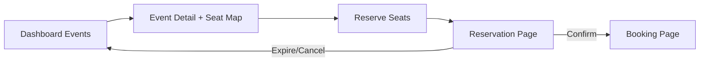
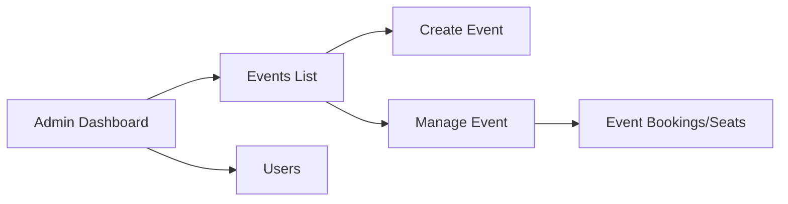

## Route Map

### Public

- `/` landing page
- `/login`
- `/register`

### User App (`/dashboard`)

- `/dashboard` event discovery
- `/dashboard/events/[id]` seat selection for an event
- `/dashboard/reservation/[reservationId]` temporary hold confirmation
- `/dashboard/booking/[bookingId]` booking success/details
- `/dashboard/account` profile and bookings history

### Admin

- `/admin` dashboard stats
- `/admin/events` events list
- `/admin/events/new` create event
- `/admin/events/[id]` edit event + bookings panel
- `/admin/users` role management

## User Flow: Discover to Booking

Detailed sequence:

1. User opens `/dashboard` and filters events.
2. Opens `/dashboard/events/[id]` to select seats.
3. Clicks reserve -> API creates reservation.
4. User lands on `/dashboard/reservation/[reservationId]` with countdown.
5. Confirm converts reservation into booking.
6. User lands on `/dashboard/booking/[bookingId]` and can download ticket.

## Expiration Behavior

If the reservation expires before confirmation:

- user is redirected to booking route with `?expired=1`
- UI explains hold expiration and suggests reselecting seats

## Account Flow

On `/dashboard/account` user can:

- view profile details
- inspect historical bookings
- navigate to specific booking details

## Admin Flow

Capabilities:

- create/update/delete events
- inspect event bookings and seat state
- view users and toggle admin role

## Redirect Compatibility

Legacy links are supported with server redirects:

- `/account`
- `/events/[id]`
- `/booking/[bookingId]`
- `/reservation/[reservationId]`

These routes are marked noindex to avoid duplicate search indexing.
